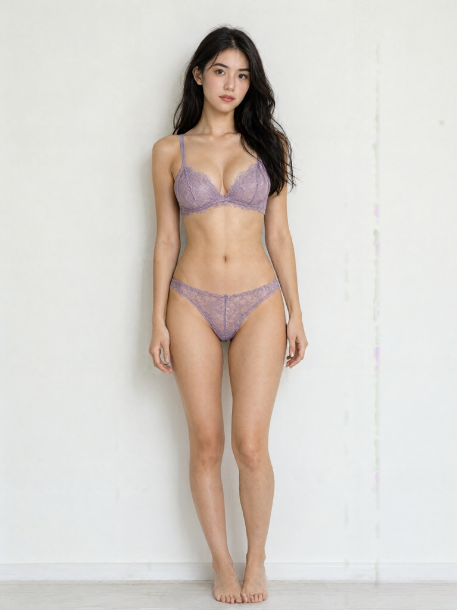
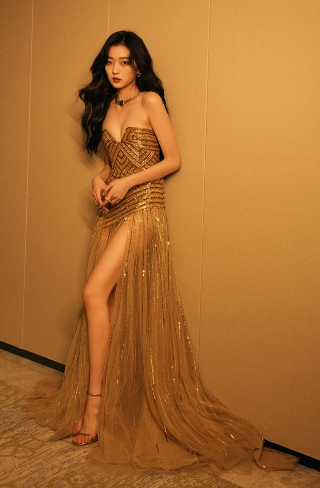
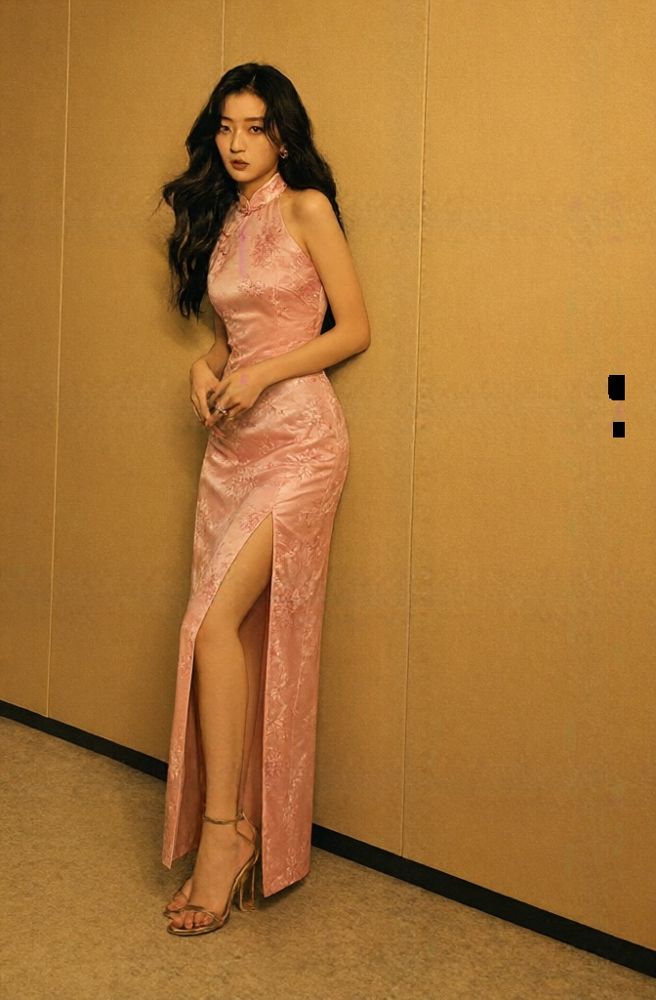

# 自然语言文本生成图像 T2I（Text To Image）

**T2I** 是（Text To Image 文生图 / 文本到图像）的缩写，指利用自然语言处理（NLP）与计算机视觉（CV）跨模态融合技术，将自然语言描述直接 **理解并生成** 为符合语义图像输出的跨模态人工智能技术。

## Qwen-Image-2.1

**Qwen-Image-2.1** 是阿里千问团队开源的一款轻量级图像生成与编辑一体化模型，其视觉生成组件仅 7B 参数，却原生支持 2K 分辨率输出与透明（RGBA）图像生成

该模型将文生图与图像编辑能力整合在同一架构中，支持最多 10 张参考图输入，并可通过圈选、涂抹或独立蒙版进行精细的局部编辑

- [基于 Qwen-Image-2.1 实现自然语言文本生成图像](./Qwen-Image-2.1/qwen_image_2.1_text_to_image.py)

  基于 Qwen-Image-2.1 模型，实现自然语言文本生成图像

  

  

  
点击展开查看

  <pre>
  Prompt:
  一张全景全身照，一位18岁可爱的中国长发女模特，皮肤较白净，自信地站立着，直视镜头。
  她身穿一套淡紫色分体式蕾丝内衣，包括精致的文胸和蕾丝内裤，均为半透光的。
  她的黑发自然下垂，表情从容。背景是纯白色的墙壁，没有多余的装饰或观众。
  光线柔和而均匀，突出了模特的气质和内衣的细节。
  高清写实风格，电影级画质，8K分辨率。
  </pre>
  
  

  

- [基于 Qwen-Image-2.1 实现根据参考图与自然语言文本生成图像](./Qwen-Image-2.1/qwen_image_2.1_text_to_image_with_reference.py)

  基于 Qwen-Image-2.1 模型，实现根据用户提供的参考图与自然语言文本，生成图像

  

  

  
点击展开查看

  <pre>
  Prompt:
  将人物改为穿粉红色的旗袍。

  保持人物的脸部、发型、身体、姿势、背景、街道环境、
  建筑物、构图和摄影角度尽可能不变。

  只修改人物的服装。

  真实摄影风格，
  自然的人物姿态，
  真实的皮肤质感，
  自然光照，
  高细节。
  </pre>
  
参考图

  
  
生成图

  
  

  

